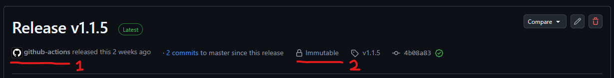

# pear-desktop-twitch-song-requests

This app adds song requests functionality to your Pear Desktop Music App!

# Streamers' instructions

1. Download the [latest](https://github.com/AzuriDayo/pear-desktop-twitch-song-requests/releases/latest) release, it is a portable executable.
2. Run the application. (Note: This app uses the port `3999` listening on `127.0.0.1` or `localhost`)
3. Once running, connect your Twitch account, and optionally your bot Twitch account if you want a separate user to reply to bot commands.
4. Naviate to the `Configure settings` page and change the Twitch Custom Reward to integrate the bot with Channel Points Redemptions. Once selected, don't forget to press `Save`.
5. Make sure your Pear Desktop is running, and enable the API Server plugin.
6. After enabling the API Server plugin, change the plugin setting for `Authorization stategy` to `No authorization`. (Note: The bot software uses the default port `26538` to connect to this API Server.)

👉 Other useful notes: [Stream features and info here](https://gist.github.com/SLAzurin/6cb6da4cb494eedd03b9efd3787aecd4)

# (Recommended optional) Download verification

You should always see this application being released by `github-actions` and releases being `immutable` as indicated from the screenshot above. This ensures the software built only comes from this official GitHub repository.

You can also validate the sha256 file hash from the release page as well. File hashes are indicated next to the file download link.

### Long term vision

It is my wish to have this application be digitally signed to be hassle free on Windows. As an indie developer, removing the Windows SmartScreen popup before running my own app would make me so happy.
